# Lab-2.1-Password-Auditing

## Overview:

When investigating this incident in Wireshark, two files were extracted from the packet capture: a suspicious executable and an encrypted spreadsheet. 

To continue the investigation, I will be exploring different hash formats (NTLM, SHA-512 etc.), extracting hashes for password cracking, and using John the Ripper and Hashcat against multiple hash types with a CeWL-generated wordlist from a targeted website. 

## 1:  Examine the Encrypted File

Using the file command against the extracted spreadsheet, I find the file type: CDFV2 Encrypted

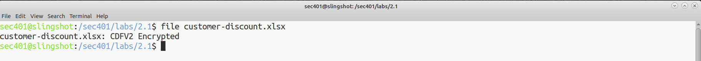

## 2: Confirming Password-Protection

I opened the spreadsheet with LibreOffice to confirm it requires a password to open. 

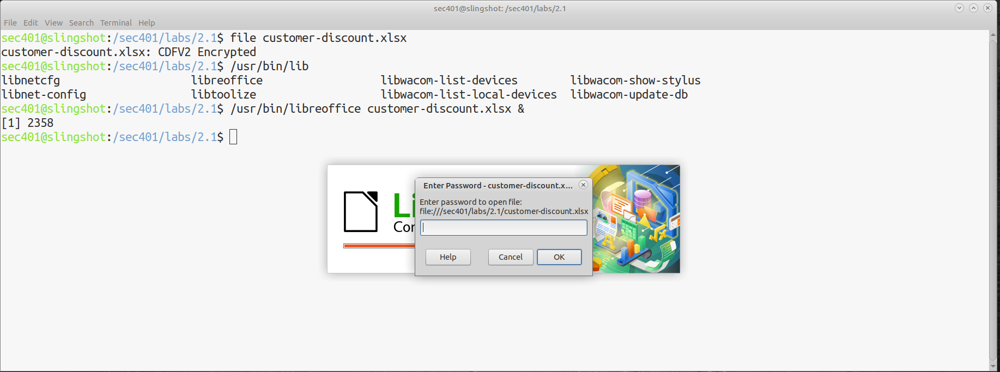

## 3. CeWL Wordlist

Provided to me was a wordlist generated by the tool CeWL (Custom Word List Generator). It contains 1552 words scraped from the Alpha.Inc website, with very company specific terms such as, “VelocityXperience” and “ArcticFlex”. Generating a targeted organization wordlist is more effective than using a generic dictionary wordlist, as employees tend to create work passwords based on familiar organization terms. 

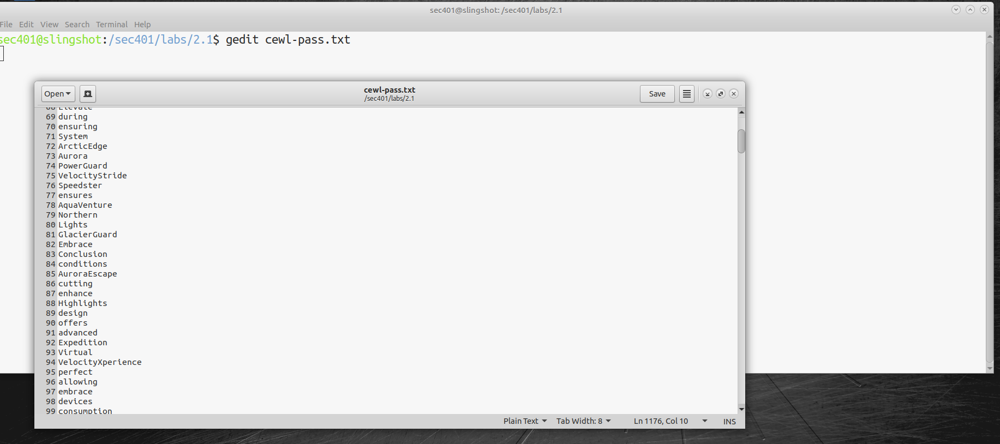

## 4: Extract Hash with office2john

I used the python script office2john.py to extract the password hash from the encrypted excel file. The output is a hash compatible with the John the Ripper cracking tool. 

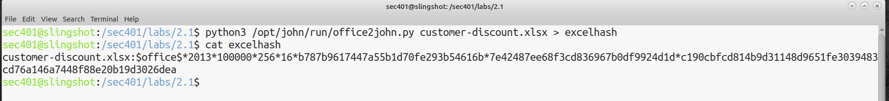

## 5: John the Ripper

I ran John the Ripper with the CeWL wordlist against the excel hash. John detected Office 2007/2010/2013 format (SHA1 256/256 AVX2 8x / SHA512 256/256 AVX2 4x AES). Note: I grabbed this screenshot while re-running the lab, and John is smart enough to not spend effort cracking a password that has already been cracked. I showed the password with the command: john --show excelhash

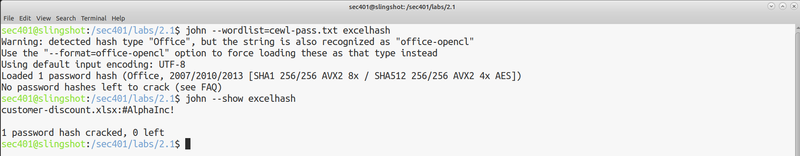

## 6: Auditing Windows Password Security

The weakness of the password from the sensitive document above prompted a security audit of user password. I was provided with a NTLM password hash of an Alpha.Inc user. Attempting to crack with John the Ripper without specifying a format showed that John detected hash type “LM” but warned it could match other formats (NT, MD2, MD4, MD5 etc.). Specifying the correct format is crucial when cracking hashes. 

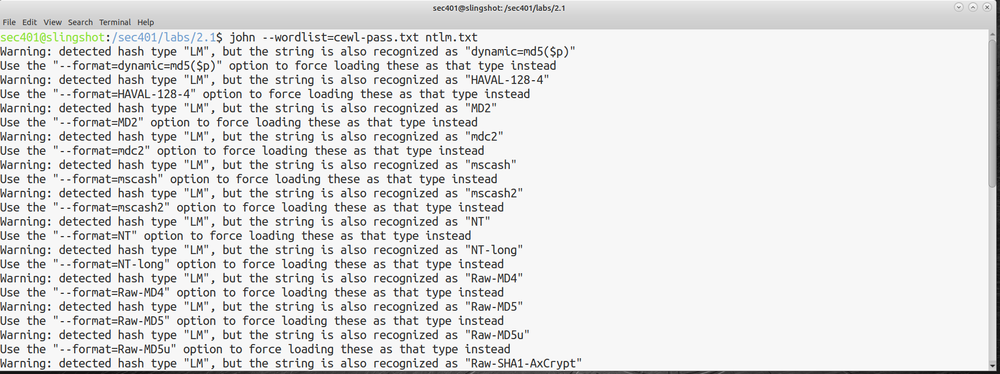

## 7: Specifying the Correct Format

Adding the parameter --format=NT forced john to treat the hash as NTLM. Note: again, I was re-running this lab and john doesn’t crack twice. I highlighted the hash john cracked found in the john.pot file. 

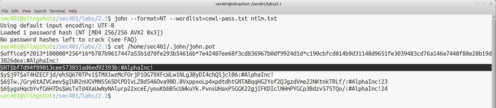

## 8: Auditing Linux Passwords

Continuing the audit with Linux user passwords, I used unshadow to merge copies of the  etc/passwd and etc/shadow files into a single file suitable for John. Alphauser had a hash identifier of $y$, indicating yescrypt was the hashing algorithm used. Alpha2 had a hash identifier of $6$, indicating SHA-512 was the hashing algorithm used. 

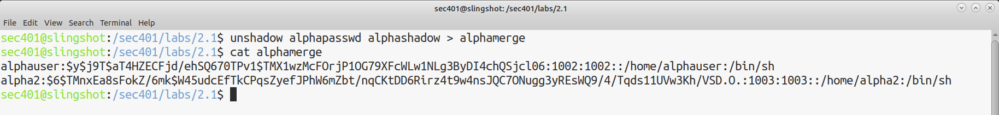

## 9: Cracking Linux Hashes

I ran John with the parameter --format=crypt which allowed John to recognize both yescrypt and SHA-512 hashes. Only alphauser’s password was cracked, meaning alpha2’s password wasn’t in the wordlist. Note: I grabbed this screenshot while re-running the lab, and John is smart enough to not spend effort cracking a password that has already been cracked. I showed the password with the command: john --show excelhash. 

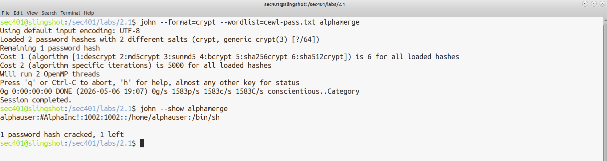

## 10: Brute-force with Hashcat

I attempted to brute-force the password using Hashcat using a mask. Since I know about Alpha.Inc’s password policies, a mask can be used to specify character sets I expect at each position of a possible password. The mask ?u?l?l?l?l?l?l?l?d specifies an uppercase first character, lowercase second through eighth characters, and a digit for the ninth character. The parameters -m 1800 specifies mode (sha512) and -a 3 specifies attack mode (brute-force)

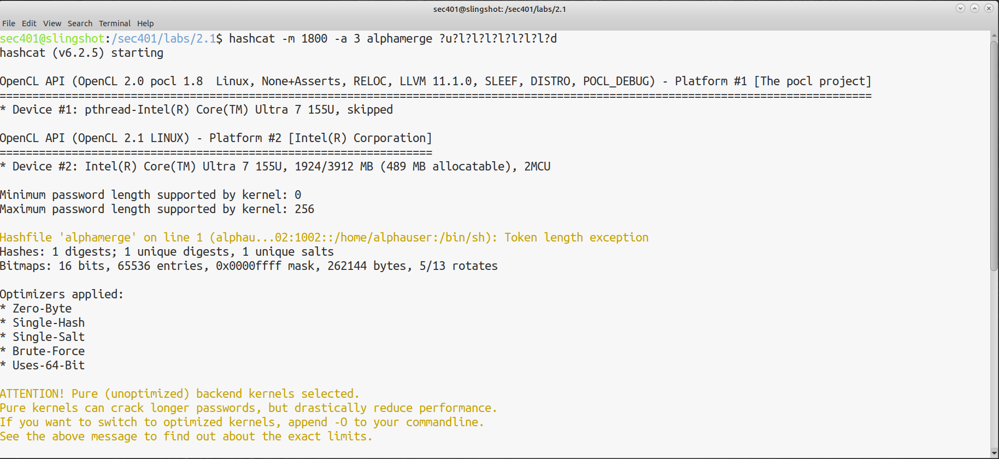

## 11: How Long?

Checking the status, Hashcat reported an estimated completion of 49 years(!) to crack the password. This shows why brute-force attack are impractical against a properly iterated hash, especially without GPU-acceleration. 

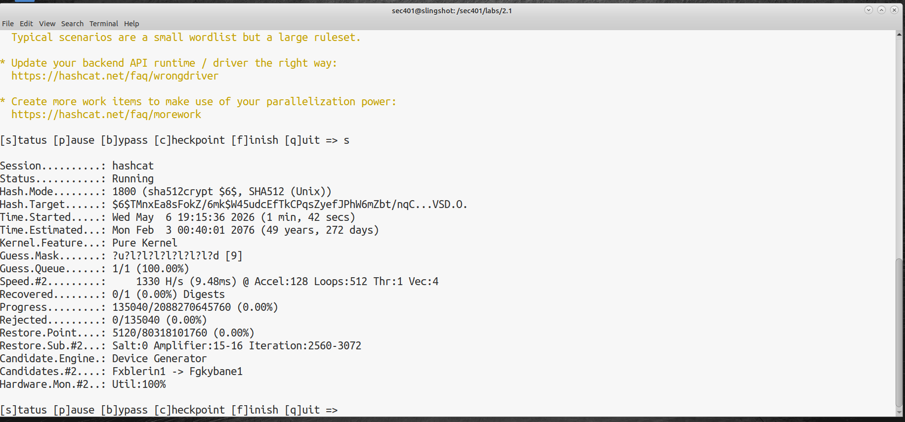

## Takeaways:

The speed at which different hash types were cracked was interesting to see. NTLM hashes were cracked extremely quickly. To this day, Windows still uses NTLM hashes for local password storage and legacy network authentication. After the password audit, the recommendation would be to disable NTLM where possible, enforce a stronger hashing algorithm (like SHA-512), and prioritize password length over complexity. 

It was also interesting to see the Hashcat brute-force attempt “fail”. On a single GPU, it could take years to crack a password. Implementing a strong password policy is crucial for exponentially slowing down a brute-force attack. 

Some other security controls to implement would be to ban organization-specific words in passwords, use modern hashing algorithms, perform regular password audits, and require MFA on all accounts. 

